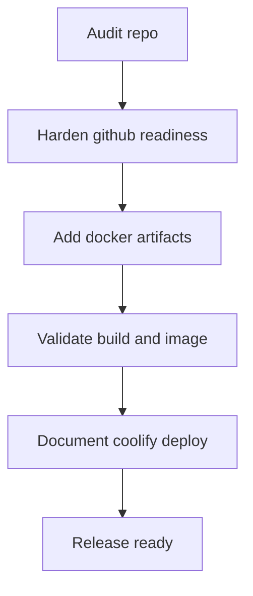

# Auditoría y Plan de Preparación para GitHub + Coolify

## 1. Hallazgos de auditoría inicial

### Estado actual del proyecto
- Aplicación frontend Vite + React + TypeScript en [`package.json`](../package.json).
- Build de producción definido en [`scripts.build`](../package.json:9) como `tsc -b && vite build`.
- Previsualización local en [`scripts.preview`](../package.json:10).
- Proyecto marcado como privado en [`private`](../package.json:4), adecuado para desarrollo local pero requiere decisión para publicación en GitHub.

### Riesgos detectados para publicar en GitHub
1. Duplicidad de versión en [`package.json`](../package.json:3) y [`package.json`](../package.json:5).
2. Falta [`/.gitignore`](../.gitignore) en raíz para excluir `node_modules`, `dist`, temporales y secretos.
3. README menciona Qualify en lugar de Coolify en [`README.md`](../README.md:53).
4. No hay lineamientos de contribución ni checklist mínimo de release.

### Riesgos detectados para despliegue en Coolify
1. No existe [`/Dockerfile`](../Dockerfile).
2. No existe [`/.dockerignore`](../.dockerignore).
3. No existe configuración de servidor estático como [`/nginx.conf`](../nginx.conf) para servir `dist`.
4. No hay estrategia documentada para variables `VITE_*` en build runtime.
5. Falta healthcheck de contenedor para observabilidad en plataforma.

---

## 2. Objetivo de preparación

Dejar el repositorio listo para:
1. Subirlo a GitHub con estructura limpia y reproducible.
2. Desplegarlo en Coolify mediante imagen Docker multi-stage optimizada.
3. Ejecutar validaciones previas de calidad para reducir fallas en deploy.

---

## 3. Plan de implementación propuesto

## Fase A - Endurecimiento para GitHub
1. Corregir duplicidad de `version` en [`package.json`](../package.json).
2. Crear [`/.gitignore`](../.gitignore) con exclusiones estándar para Node/Vite.
3. Revisar y mejorar [`README.md`](../README.md) con sección oficial de GitHub + Coolify.
4. Añadir pasos de verificación local obligatoria antes de push.

## Fase B - Contenerización para Coolify
1. Crear [`/Dockerfile`](../Dockerfile) multi-stage:
   - Stage build con Node LTS.
   - Stage runtime con Nginx Alpine.
2. Crear [`/nginx.conf`](../nginx.conf) para SPA fallback a `index.html`.
3. Crear [`/.dockerignore`](../.dockerignore) para minimizar contexto de build.
4. Definir `EXPOSE 80` y healthcheck HTTP.

## Fase C - Optimización y operación
1. Documentar variables de entorno compatibles con Vite.
2. Definir pipeline mínima en GitHub Actions para:
   - Install
   - Build
   - Type-check
3. Validar tamaño de imagen y reproducibilidad del build.
4. Completar checklist final de seguridad y performance.

---

## 4. Checklist de auditoría completa

### Seguridad
- [ ] Sin secretos en repositorio.
- [ ] `.env*` ignorado por Git.
- [ ] Dependencias sin vulnerabilidades críticas.

### Calidad técnica
- [ ] `npm ci` reproducible.
- [ ] `npm run build` exitoso.
- [ ] `npm run preview` funcional.

### Contenedor
- [ ] Docker build exitoso.
- [ ] Contenedor responde en `/`.
- [ ] SPA routing fallback configurado.
- [ ] Healthcheck operativo.

### Operación en Coolify
- [ ] Puerto interno correcto.
- [ ] Build/Start command claros en documentación.
- [ ] Variables de entorno definidas y probadas.

---

## 5. Flujo de arquitectura propuesto

---

## 6. Decisiones pendientes para cerrar el alcance

1. Publicación en GitHub:
   - Mantener [`private`](../package.json:4) para paquete npm y publicar solo código en repo.
2. Base de runtime:
   - Nginx Alpine recomendada para servir estáticos de Vite.
3. CI mínima:
   - Ejecutar build y type-check en cada push a `main`.

Con estas decisiones, la implementación en modo Code puede ejecutarse de forma directa y en orden.
